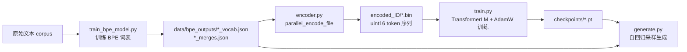

# CS336 Assignment 1: Basics — 项目概览

本项目是 **CS336 (Stanford) Spring 2025 Assignment 1** 的从零实现版本，目标是**不依赖高级封装库**，纯手写构建大语言模型（LLM）所需的核心组件，包括：

1. **BPE 分词器**（训练 + 编码 + 解码）
2. **Decoder-only Transformer 语言模型**（线性层、嵌入、RMSNorm、SwiGLU、RoPE、多头注意力、Transformer 块等全部手写）
3. **训练管线**（AdamW 优化器、余弦学习率、梯度裁剪、数据批处理、checkpoint）
4. **文本生成**（temperature 缩放 + top-p 采样）

主要代码位于 `cs336_basics/` 目录，单元测试位于 `tests/`（通过 `tests/adapters.py` 连接到本实现）。

---

## 目录结构

```
cs336_basics/
├── __init__.py                  # 包版本信息
├── bpe.py                       # BPE 分词器：训练 / 编码 / 解码 / 多进程并行处理
├── encoder.py                   # 入口：将 OpenWebText 大文本编码为二进制 token 文件
├── pretokenization_example.py   # 多进程预分词切块示例
├── train_bpe_model.py           # 入口：训练 TinyStories / OpenWebText 的 BPE 词表
├── model.py                     # Transformer 语言模型全部组件
├── train.py                     # 入口：训练 Transformer 语言模型
└── generate.py                  # 入口：加载 checkpoint 生成文本
```

---

## 1. `cs336_basics/__init__.py`

**功能**：包初始化，仅 3 行。

```python
import importlib.metadata
__version__ = importlib.metadata.version("cs336_basics")
```

**核心逻辑**：通过 `importlib.metadata` 读取 `pyproject.toml` 中声明的包版本号 `1.0.5`，作为包的 `__version__` 属性。

---

## 2. `cs336_basics/bpe.py`（714 行）— 分词器核心

这是整个项目的第一个核心模块，实现了 **GPT-2 风格字节级 BPE** 的完整生命周期。

### 2.1 预分词正则 `PAT`

```python
PAT = re.compile(r"""'s|'t|'re|'ve|'m|'ll|'d| ?\p{L}+| ?\p{N}+| ?[^\s\p{L}\p{N}]+|\s+(?!\S)|\s+""")
```

**核心算法**：模拟 GPT-2 的预分词（pre-tokenization），按优先级将文本切分为“预词元”：

| 模式 | 含义 |
|------|------|
| `'s\|'t\|'re\|'ve\|'m\|'ll\|'d` | 英文常见缩写（如 `don't` → `don` + `'t`） |
| ` ?\p{L}+` | 可选空格 + 一个或多个字母（`\p{L}` 匹配任意语言字母） |
| ` ?\p{N}+` | 可选空格 + 一个或多个数字 |
| ` ?[^\s\p{L}\p{N}]+` | 标点/符号 |
| `\s+(?!\S)` | 行尾空白 |
| `\s+` | 兜底空白 |

### 2.2 关键数据结构

- `_SINGLE_BYTE = [bytes([i]) for i in range(256)]`：预创建 256 个单字节对象，避免每次切片都新建对象，大幅加速字节转换。

### 2.3 `find_chunk_boundaries(file, desired_num_chunks, split_special_token)`

**功能**：在二进制文件中寻找合适的切分边界，使每个块都以特殊 token（如 `<|endoftext|>`）开头，从而各块可被多进程**独立**统计词频，不会把 token 切半。

**核心算法**：
1. 求文件总大小 `file_size`，初始按 `chunk_size = file_size // desired_num_chunks` 等距切分。
2. 对每个内部边界，以 4KB 为单位向前探测，找到第一个特殊 token 的起始偏移作为调整后的边界。
3. 找不到则推到文件末尾；最后去重排序，返回实际边界列表（可能少于期望块数）。

### 2.4 `process_chunk(args)` — 多进程词频统计 worker

**功能**：处理一个文件块，返回该块内所有“单词”（单字节元组）的 `Counter`。

**核心算法**：
1. 按字节偏移读取块 → UTF-8 解码。
2. 若有特殊 token，先用正则 `re.split(f"({st_pattern})", text)` 分割并跳过这些 token。
3. 对每段用 `PAT.finditer` 统计词频。
4. 只对 unique 单词做 `encode → 单字节元组` 转换，减少重复转换开销。

### 2.5 `train_bpe(input_path, vocab_size, special_tokens)` — BPE 训练主算法

这是 `bpe.py` 最核心的函数，返回 `(vocab, merges)`：

- `vocab`: `{id: bytes}`，id 0~255 为单字节，之后为特殊 token 和合并结果。
- `merges`: `[(a, b), ...]` 按训练顺序记录的合并规则。

**核心算法**（字节对编码 Byte Pair Encoding）：

**Step 1 — 词频统计**：支持两条路径：
- 若含 `<|endoftext|>`：多进程并行（`multiprocessing.Pool` + `imap_unordered`），按 **50MB 绝对块**切分（OOM 优化点，避免按核数切导致单块过大）。
- 否则：单进程缓冲池分块读取（50MB 内存上限，且避免在连续换行 `\n\n` 处截断）。

**Step 2 — 初始化**：
- `vocab = {0..255: 单字节}`；`merges = []`。
- 词表剩余容量 = `vocab_size - 256 - len(special_tokens)`，即需要执行的合并次数。

**Step 3 — 用“并行数组 + 双向链表”表示每个单词**：
- `node_val/prev/next/valid/count`：每个单词的字节序列被表示为节点数组，节点间用前驱/后继索引串成双向链表（类似 GPT-2 论文的链表实现），便于 O(1) 局部更新。
- `pair_occ_list` / `pair_pre_occ_list` / `pair_latest_occ`：用“单向 occurrence 链表”记录每个字节对 `(a, b)` 出现的所有左节点位置，避免合并时扫描整条单词链表。

**Step 4 — 最大堆 + 懒删除**：
- 自定义 `HeapNode` 并覆写 `__lt__`，实现最大堆：**先比频次，频次相同则按字节串字典序降序**（复刻 GPT-2 的确定性 tie-breaker，保证跨平台合并顺序一致）。
- 合并循环（`num_merges` 次）：
  1. 从堆顶弹出合法（频次与 `pairs` 中当前值一致）的最高频字节对 `(a, b)`，跳过过期条目（懒删除）。
  2. 追加 `merges.append((a, b))`。
  3. 通过 occurrence 链表拿到所有出现位置（逆序后从左到右处理）。
  4. 对每个出现位置：删除旧字节对 `(a,b)`、`(prev,a)`、`(b,next)` 的频次，把节点值改为 `a+b`，跳过 `b` 节点，新增字节对 `(prev,ab)`、`(ab,next)` 的频次，并把新 occurrence 追加进链表。
  5. 把被改动的字节对（`dirty_pairs`）重新压入堆（旧条目由懒删除忽略）。

**Step 5 — 构建最终词表**：按 `256 → 特殊 token → 合并结果顺序` 分配 id。

### 2.6 `class Tokenizer` — 编码 / 解码

**构造**：构建 `bytes_to_id` 反向映射、`bpe_ranks`（合并规则 rank 字典，用于 O(1) 优先级查询）、按长度降序的特殊 token 列表、单词编码缓存。

**`encode(text) -> list[int]`**：
1. 按特殊 token 分割文本（保留分隔符）。
2. 特殊 token 直接映射 id；普通部分用 `PAT.finditer` 预分词。
3. **贪心 BPE 合并**：对每个单词的字节序列，循环寻找 `bpe_ranks` 中 rank 最小（优先级最高）的相邻对并合并，直到无可合并对。相比“每次遍历全部 merges”的朴素 O(V) 实现，这里用 rank 字典将复杂度降到线性级别。
4. 结果缓存到 `self.cache`，加速重复单词。

**`encode_iterable(iterable)`**：惰性流式编码，按 200MB 缓冲拼接后批量编码并逐块 yield，适合处理大文件/流式数据且不爆内存。

**`decode(ids) -> str`**：拼接所有 id 对应的字节串 → UTF-8 解码（非法字节替换为 `U+FFFD` `�`）。

**`from_files`**：从 pickle 文件加载 vocab / merges 构造分词器。

### 2.7 辅助加载函数（JSON 持久化）

- `load_vocab_json` / `load_merges_json`：从 JSON 加载词表与合并规则。由于 JSON 只能存文本，词表的字节串以 **latin-1** 编码字符串保存（1:1 可逆，任意字节值 0~255 都能映射）。

### 2.8 多进程并行编码

- `_init_worker`：子进程初始化时加载 tokenizer（避免每个块重复加载）。
- `_encode_file_chunk`：子进程工作函数，编码一个文件块。
- `parallel_encode_file(...)`：主函数。
  1. 校验特殊 token 含 `<|endoftext|>`。
  2. 用 `find_chunk_boundaries` 按目标块大小（默认 100MB）切块。
  3. `multiprocessing.Pool` + `imap` 并行编码每个块，将 token 列表转 `uint16` 数组二进制追加写入 `.bin` 文件。
  4. 返回总 token 数。

---

## 3. `cs336_basics/encoder.py`（57 行）— OpenWebText 编码入口

**功能**：把大型 OpenWebText 文本文件编码为二进制 token 文件。

**配置区域**：定义 `OWT_INPUT`（原始文本）、`OWT_VOCAB` / `OWT_MERGES`（训练好的词表/合并规则）、`OUTPUT_DIR`（输出目录）。

**核心流程（`main()`）**：
1. 调用 `parallel_encode_file`，6 进程、每块 100MB，特殊 token 为 `["<|endoftext|>"]`。
2. 输出 `openwebtext_encoded.bin`（每个 token 占 2 字节，即 `uint16`）。
3. 测算吞吐量（Bytes/s、MB/s），并据此估算处理 825GB The Pile 语料所需时间。

> 说明：读取该二进制文件可用 `np.fromfile('...bin', dtype=np.uint16)`。

---

## 4. `cs336_basics/pretokenization_example.py`（62 行）— 预分词示例

**功能**：与 `bpe.py` 中 `find_chunk_boundaries` 相同的一份独立示例实现，用于演示“如何将大文件切块后交给多进程做预分词统计”。

**核心算法**：在文件内等距猜测边界，以 4KB 为单位向前探测特殊 token `<|endoftext|>`，将边界对齐到 token 起始处；然后对每个 `[start, end)` 块独立解码 + 预分词。展示了可并行化的串行实现框架。

---

## 5. `cs336_basics/train_bpe_model.py`（102 行）— BPE 训练入口

**功能**：命令行脚本，对两个数据集训练 BPE 词表并保存为 JSON。

**配置（`TASKS`）**：

| 数据集 | 路径 | 目标词表大小 | 特殊 token |
|--------|------|--------------|------------|
| TinyStories | `/root/autodl-tmp/data/TinyStoriesV2-GPT4-train.txt` | 10000 | `<|endoftext|>` |
| OpenWebText | `/root/autodl-tmp/data/owt_valid.txt` | 32000 | `<|endoftext|>` |

**核心流程（`main()`）**：
1. 对每个任务调用 `train_bpe(input_path, vocab_size, special_tokens)`。
2. 用 `save_vocab_json` / `save_merges_json` 保存：
   - 词表：`{str(id): latin-1字符串}` 写入 `data/bpe_outputs/{name}_vocab.json`。
   - 合并规则：`[[a, b], ...]`（latin-1 字符串对）写入 `{name}_merges.json`。
3. 打印训练耗时、词表大小、合并数。

---

## 6. `cs336_basics/model.py`（794 行）— Transformer 模型核心

这是整个项目的**第二个核心模块**，所有深度学习组件均为手写（仅依赖 `torch.nn.Module` / `nn.Parameter` 等基础设施，不依赖 `nn.Linear`、`nn.MultiheadAttention` 等高层封装）。

### 6.1 基础模块

**`class Linear`** — 无 bias 线性层
- 权重形状 `(out_features, in_features)`。
- 前向：`y = x @ W.T`（行向量约定）。
- 初始化：截断正态 `N(0, 2/(d_in + d_out))`，clip 到 `[-3σ, 3σ]`。

**`class Embedding`** — 嵌入查表
- 权重形状 `(num_embeddings, embedding_dim)`。
- 前向：`self.weight[token_ids]`，`(..., seq_len) → (..., seq_len, d_model)`。
- 初始化：截断正态 `N(0, 1)`，clip 到 `[-3, 3]`。

### 6.2 归一化与激活

**`class RMSNorm`**（Root Mean Square Layer Normalization）
$$ \text{RMSNorm}(a_i) = \frac{a_i}{\sqrt{\text{mean}(a_i^2) + \epsilon}} \cdot g_i $$
- 前向：先 upcast 到 float32 计算（数值稳定性），再转回原 dtype。
- 无 bias、无均值中心化，是 LayerNorm 的轻量替代。

**`class SiLU`**（Swish）
$$ \text{SiLU}(x) = x \cdot \sigma(x) = \frac{x}{1 + e^{-x}} $$

### 6.3 前馈网络

**`class PositionWiseFeedForward`** — SwiGLU
$$ \text{FFN}(x) = W_2\big(\text{SiLU}(W_1 x) \odot W_3 x\big) $$
- 三个线性层 `w1, w2, w3`，其中 `w1` 输出经 SiLU 后与 `w3` 输出逐元素相乘（门控），再经 `w2` 投影回 `d_model`。
- `d_ff ≈ (8/3)·d_model`（通常取 64 的倍数，LlaMA 风格）。

**`class SiLUFeedForward`** — 无门控 SiLU（消融对比用）
$$ \text{FFN}(x) = W_2\,\text{SiLU}(W_1 x) $$
- 用 `d_ff = 4·d_model` 以匹配 SwiGLU 的参数量（消融实验）。

### 6.4 位置编码 — `class RotaryPositionalEmbedding`（RoPE）

**核心算法**：对嵌入向量按“成对旋转”注入位置信息，无学习参数。
1. 频率：`freqs[i] = 1 / theta^(2i/d_k)`，`i = 0..d_k/2-1`。
2. 角度：`angles[pos, i] = pos * freqs[i]`。
3. 预计算 `cos` / `sin` buffer（`max_seq_len × d_k/2`），非持久化（不进 state_dict）。
4. 前向：把 `d_k` 维向量 reshape 成 `d_k/2` 对 `(x0, x1)`，按位置索引 cos/sin 应用旋转：
$$ \begin{aligned} x_0' &= x_0\cos\theta - x_1\sin\theta \\ x_1' &= x_0\sin\theta + x_1\cos\theta \end{aligned} $$
5. 支持任意 `token_positions`（不仅是 0..seq-1）。

### 6.5 注意力

**`softmax(x, dim)`** — 数值稳定 softmax：先减每行最大值再指数归一化。

**`scaled_dot_product_attention(Q, K, V, mask)`**
$$ \text{Attention}(Q, K, V) = \text{softmax}\!\left(\frac{QK^\top}{\sqrt{d_k}} + \text{mask}\right) V $$
- `mask` 支持布尔（`True` 保留 / `False` 掩成 `-inf`）或浮点（直接相加）。

**`class MultiheadSelfAttention`** — 因果多头自注意力（可选 RoPE）
1. 单矩阵投影得到 `Q, K, V`（各 `(d_model, d_model)`），拆分为 `num_heads` 个 `d_k` 维头。
2. 若启用 RoPE，对每个头的 `Q, K` 施加旋转位置编码。
3. 用下三角布尔矩阵构造**因果 mask**，保证 token 只能看到自己及之前的 token。
4. 缩放点积注意力 → 拼接所有头 → `output_proj` 投影回 `d_model`。

### 6.6 Transformer 块 — `class TransformerBlock`

支持三种归一化策略（供消融）：
- **Pre-norm（默认）**：
$$ y = x + \text{Attn}\big(\text{RMSNorm}(x)\big), \quad z = y + \text{FFN}\big(\text{RMSNorm}(y)\big) $$
- **Post-norm**：
$$ y = \text{RMSNorm}\big(x + \text{Attn}(x)\big), \quad z = \text{RMSNorm}\big(y + \text{FFN}(y)\big) $$
- **无归一化**（`remove_rmsnorm`）：去掉 RMSNorm，直接残差。

### 6.7 完整语言模型 — `class TransformerLM`

**架构**（decoder-only）：
```
token embeddings → [num_layers × TransformerBlock] → final RMSNorm → lm_head
```

- `lm_head = Linear(d_model, vocab_size)` 输出每个位置在词表上的 logits。
- 前向：`(batch, seq) → (batch, seq, vocab_size)`。
- 支持消融开关：`use_post_norm`、`remove_rmsnorm`、`remove_rope`、`ffn_type`（`swiglu`/`silu`）。

### 6.8 损失函数 — `cross_entropy`

**核心算法**：用 log-sum-exp 技巧保证数值稳定：
$$ \text{loss} = \Big[\log\!\sum_j e^{\ell_j - \ell_{\max}} - \ell_{\text{target}} + \ell_{\max}\Big]_{\text{mean}} $$
即 `logsumexp - log_probs[target]`，对 batch 取平均。

### 6.9 优化器 — `class AdamW`（Loshchilov & Hutter 2019）

**核心算法**（解耦权重衰减）：
1. 一阶矩：$m_t = \beta_1 m_{t-1} + (1-\beta_1) g_t$
2. 二阶矩：$v_t = \beta_2 v_{t-1} + (1-\beta_2) g_t^2$
3. 偏差修正：$\hat m = m_t/(1-\beta_1^t)$，$\hat v = v_t/(1-\beta_2^t)$
4. 参数更新：$p \gets p - \text{lr}\cdot \dfrac{\hat m}{\sqrt{\hat v}+\epsilon}$
5. **解耦权重衰减**：$p \gets p - \text{lr}\cdot\text{wd}\cdot p$（与梯度无关，直接作用在参数上）

### 6.10 学习率调度 — `get_lr_cosine_schedule`

**核心算法**：线性 warmup + 余弦退火：
$$ \text{lr}(t) = \begin{cases} \dfrac{t}{T_w}\,\alpha_{\max} & t < T_w \\[6pt] \alpha_{\min} + \dfrac{1+\cos(\pi\cdot\frac{t-T_w}{T_c-T_w})}{2}\,(\alpha_{\max}-\alpha_{\min}) & T_w \le t \le T_c \\[4pt] \alpha_{\min} & t > T_c \end{cases} $$

### 6.11 梯度裁剪 — `gradient_clipping`

**核心算法**：计算所有参数梯度的全局 L2 范数，若超过阈值 `max_l2_norm`，则整体等比缩放：
$$ g \gets g \cdot \frac{\text{max\_l2\_norm}}{\|g\|_2 + 10^{-6}} $$

### 6.12 数据批处理 — `get_batch`

**核心算法**：
1. 随机采样 `batch_size` 个起始位置（范围保证序列完整）。
2. `inputs = dataset[s : s + context]`，`targets = dataset[s+1 : s+context+1]`（**右移一位**，即下一个 token 作为标签）。
3. 转为 LongTensor 并搬到指定设备。

---

## 7. `cs336_basics/train.py`（431 行）— 训练脚本

**功能**：命令行驱动的完整训练管线。

### 关键函数

**`load_memmap(data_path)`**：加载训练数据。
- `.npy` → `np.load(mmap_mode="r")`。
- `.bin` → 校验文件大小是 `uint16` 的整数倍，`np.memmap` 内存映射读取（不占内存）。

**`train_one_epoch(...)`**：主训练循环。
- **梯度累积**：`effective_batch_size = micro_batch × gradient_accumulation_steps`；每个优化步前累积多个微批的梯度（loss 除以累积步数），再统一裁剪、更新。
- 每 `log_interval` 步打印 loss / lr / tok/s / 耗时。
- 每 `val_interval` 步在验证集上评估（`evaluate`），记录最佳验证 loss 并保存 `best_checkpoint.pt`。
- 每 `save_interval` 步保存 `checkpoint_step_{N}.pt`。

**`evaluate(model, val_data, ...)`**：`@torch.no_grad()` 下评估固定 `num_batches=50` 个 batch 的平均交叉熵 loss。

**`save_checkpoint`**：保存 `model_state_dict`、`optimizer_state_dict`、`step` 以及完整模型配置（vocab_size、context_length、d_model、num_layers、num_heads、d_ff、rope_theta），便于无缝恢复。

**`load_checkpoint`**：加载 checkpoint（`weights_only=True` 保证安全）。

### `main()` 命令行参数

| 类别 | 参数 | 默认 |
|------|------|------|
| 数据 | `--train-data`, `--val-data` | 必填 / None |
| 架构 | `--vocab-size`, `--context-length`, `--d-model`, `--num-layers`, `--num-heads`, `--d-ff`, `--rope-theta` | 10000 / 256 / 512 / 4 / 16 / 1344 / 10000 |
| 消融 | `--use-post-norm`, `--remove-rmsnorm`, `--remove-rope`, `--ffn-type`(swiglu/silu) | 关 / 关 / 关 / swiglu |
| 训练 | `--batch-size`, `--gradient-accumulation-steps`, `--total-steps`, `--max-lr`, `--min-lr`, `--warmup-iters`, `--gradient-clip` | 32 / 1 / 5000 / 6e-4 / 6e-5 / 200 / 1.0 |
| AdamW | `--beta1`, `--beta2`, `--adam-eps`, `--weight-decay` | 0.9 / 0.999 / 1e-8 / 1e-1 |
| 恢复 | `--resume` | None |
| I/O | `--save-dir`, `--device`, `--log-interval`, `--val-interval`, `--save-interval`, `--seed` | ./checkpoints / auto / 10 / 100 / 1000 / 42 |

**`main()` 核心流程**：
1. 解析参数 → 自动选择设备（cuda → mps → cpu）→ 设置随机种子。
2. 加载训练/验证数据（内存映射）。
3. 构建 `TransformerLM`（含消融配置）。
4. 可选 `--resume` 恢复模型与步数。
5. 统计参数（总参数、非嵌入参数）。
6. 创建 `AdamW`，恢复优化器状态。
7. 调用 `train_one_epoch` 训练。

**用法示例**（来自文件头）：
```sh
python -m cs336_basics.train \
    --train-data encoded_ID/owt_train_encoded.bin \
    --vocab-size 32000 --d-model 768 --d-ff 2048 \
    --num-layers 6 --num-heads 12 --batch-size 16 \
    --gradient-accumulation-steps 4 --total-steps 10000 \
    --max-lr 6e-4 --min-lr 6e-5 --warmup-iters 2000 \
    --gradient-clip 1.0 --save-dir ./checkpoints/owt --device cuda
```

---

## 8. `cs336_basics/generate.py`（343 行）— 文本生成

**功能**：加载训练好的 checkpoint + 词表，从 prompt 自回归生成文本，支持 temperature、top-p 采样和实时流式输出。

### 关键函数

**`load_vocab`**：从 vocab JSON 加载 `{id: bytes}` 映射（latin-1 解码）。

**`decode_tokens`**：拼接字节串 → UTF-8 解码（非法字节替换为 `�`）。

**`generate(...)`** — 自回归生成主算法：
1. 初始化 `generated = prompt_ids`。
2. 每次取最近 `context_length` 个 token 作为上下文，前向得到 logits。
3. 取最后一个位置的 logits `(vocab_size,)`，按策略采样：
   - **`temperature == 0`** → 贪心：`argmax`。
   - **否则** → `probs = softmax(logits / temperature)`。
   - **`top_p` 启用** → `_sample_top_p`。
   - **否则** → `torch.multinomial(probs)` 从全分布采样。
4. 追加新 token；命中 `eos_token_id` 则提前停止；最多生成 `max_tokens - len(prompt)` 个。

**`_sample_top_p(probs, top_p)`** — **Nucleus（top-p）采样核心算法**：
1. 按概率降序排序，计算累积概率 `cumulative_probs`。
2. 掩掉“累积概率已超过 `top_p`”之后的低概率 token（`cumulative_probs - sorted_probs > top_p`），即保留构成累计概率 `top_p` 的最小 token 集合（nucleus）。
3. 对保留的分布**重新归一化**。
4. 用 `multinomial` 采样，映射回原始 token id。

**`load_model_from_checkpoint`**：读取 checkpoint 中的 `config` 重建 `TransformerLM` 并加载权重。

### `main()` 核心流程
1. 解析参数（checkpoint、vocab、prompt 文件/偏移/长度、温度、top-p、EOS、输出路径）。
2. 自动选设备、可选种子。
3. 加载词表与模型。
4. 用 `np.memmap` 读取 prompt `.bin` 文件，按 offset/length 取 prompt token。
5. 实时解码：通过 `on_token` 回调把每个新 token 立即解码并打印/写入文件（流式体验）。
6. 统计生成 token 数与吞吐（tok/s）。

**用法示例**（来自文件头）：
```sh
python -m cs336_basics.generate \
    --checkpoint checkpoints/owt/checkpoint_step_8000.pt \
    --vocab-json bpe_outputs/openwebtext_vocab.json \
    --prompt-file encoded_ID/TinyStoriesV2-GPT4-train_encoded.bin \
    --prompt-offset 64 --prompt-length 200 \
    --max-tokens 1024 --temperature 0.8 --top-p 0.9 \
    --eos-id 0 --output ./gen_txt/tiny.txt
```

---

## 数据流总览（端到端）



1. **训练 BPE**（`train_bpe_model.py` → `bpe.train_bpe`）：统计词频 → 字节对合并 → 输出词表与合并规则（JSON）。
2. **编码数据**（`encoder.py` → `bpe.parallel_encode_file`）：用训练好的分词器把大语料切成 token，存为 `uint16` 二进制。
3. **训练模型**（`train.py` → `model.py`）：`TransformerLM` 在 token 序列上做 next-token 预测，用 `AdamW` + 余弦学习率 + 梯度裁剪训练，保存 checkpoint。
4. **生成**（`generate.py` → `model.py`）：加载 checkpoint，从 prompt 用 temperature + top-p 采样逐 token 自回归生成。

---

## 测试与运行

- **运行单元测试**：`uv run pytest`（本实现通过 `tests/adapters.py` 接入测试）。
- **运行任意脚本**：`uv run python -m cs336_basics.<模块名>`（如 `train`、`generate`、`train_bpe_model`、`encoder`）。
- 依赖管理使用 `uv`（见 `pyproject.toml`，镜像源已配置为 USTC PyPI 镜像）。
